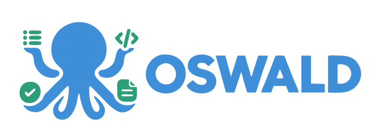

<p align="center">
  
</p>

<p align="center">
  <strong>Deterministic, multi-agent pipeline for autonomous software engineering</strong>
</p>

<p align="center">
  <a href="https://github.com/astral-sh/uv"></a>
  <a href="https://docs.astral.sh/ruff"></a>
  
  
  <a href="LICENSE"></a>
</p>

<br>

**OSWALD** is an autonomous software development pipeline that coordinates four discrete agent roles over an asynchronous HTTP API. Instead of unpredictable execution loops, OSWALD enforces a **deterministic state machine** with isolated container execution, immutable artifact handoffs, and a mandatory **human approval gate** before code is pushed to VCS.

---

## Table of Contents

- [Pipeline Lifecycle](#pipeline-lifecycle)
- [Tech Stack](#tech-stack)
- [Quickstart](#quickstart)
- [Developer Workflow](#developer-workflow)
- [Architectural Boundaries](#architectural-boundaries)
- [Documentation](#documentation)
- [Contributing](#contributing)

---

## Pipeline Lifecycle

OSWALD transitions deterministically through four specialized roles, passing immutable Pydantic artifacts between stages:

```text
[ Task Request ] ──► ( Planner ) ──► spec.md ──► ( Coder ) ──► changes.md + diff
                                                                   │
[ Git PR / Push ] ◄── [ Human Approval Gate ] ◄── review.md ◄─────┴──► ( Tester ) ──► test-results.md ──► ( Reviewer )
```

| Stage | Role | Tool Permissions | Output Artifact |
| :--- | :--- | :--- | :--- |
| **1. Planner** | Analyzes problem statement, resolves ambiguities | Read-only workspace inspection | `spec.md` |
| **2. Coder** | Implements specification in Docker sandbox | File edit, bash in sandbox | `changes.md` + diff |
| **3. Tester** | Authors and runs test suites inside sandbox | Test runner in sandbox | `test-results.md` |
| **4. Reviewer** | Evaluates code against specification & coverage | Read-only diff & spec | `review.md` (verdict) |
| **Approval Gate** | **Human Technical Sign-off** | Human reviewer inspects diff | PR creation unblocked |

> **Security Rule:** Agents are strictly forbidden from pushing branches or creating PRs directly. All VCS mutations require explicit human approval.

---

## Tech Stack

* **Language & Runtime:** Python 3.12+, native `asyncio`
* **Package Management:** [`uv`](https://docs.astral-sh/uv/) (blazing fast dependency sync & pinned `uv.lock`)
* **API & Job Queue:** [FastAPI](https://fastapi.tiangolo.com/) + [Taskiq](https://taskiq-python.github.io/) (Redis broker)
* **LLM Engine:** Raw Anthropic SDK via provider-neutral `LLMClient` protocol
* **Data Contracts:** [Pydantic v2](https://docs.pydantic.dev/) (immutable schemas, zero ORM coupling)
* **Backing Services:** PostgreSQL 16 + Redis 7 (orchestrated via Docker Compose)
* **Quality Tooling:** `ruff` (lint/format), `mypy` (strict types), `import-linter` (boundary contracts), `pytest`

---

## Quickstart

### Prerequisites
* Python 3.12+
* [`uv`](https://docs.astral.sh/uv/getting-started/installation/)
* Docker & Docker Compose

### 1. Clone & Setup
```bash
git clone https://github.com/Oswald-Agent/Oswald.git
cd Oswald

# Copy environment template
cp .env.example .env

# Install dependencies and sync virtual environment
uv sync
```

### 2. Start Backing Services
```bash
# Starts local PostgreSQL and Redis containers in background
make up
```

### 3. Run Verification Suite
```bash
# Runs ruff, mypy, import-linter, and unit tests
make check
```

---

## Developer Workflow

All common developer tasks are encapsulated in the root `Makefile`:

```bash
make install          # Sync virtual environment dependencies via uv sync
make format           # Automatically format codebase using ruff
make lint             # Run ruff code quality checks
make typecheck        # Run strict static type checking via mypy
make imports          # Verify architectural boundary contracts via import-linter
make test             # Run fast unit tests (excludes @pytest.mark.integration)
make test-integration # Run integration tests against Postgres & Redis
make check            # Run full verification suite (lint, format, types, imports, tests)
make up               # Start local Postgres and Redis containers
make down             # Stop local Postgres and Redis containers
```

---

## Architectural Boundaries

OSWALD enforces hard architectural boundaries via `import-linter` (enforced on every `make check` and CI run):

1. **`core/` Framework Isolation:** Contains pure business logic. Forbidden from importing `oswald.api`, `oswald.workers`, or `oswald.db`.
2. **`core/artifacts/` Pydantic Purity:** Immutable pipeline handoffs. Forbidden from importing `sqlalchemy` or ORM models.
3. **Single Entry Point:** `core/services` is the exclusive public interface into `core/orchestrator`.
4. **VCS Segregation:** Only `core/vcs` is authorized to run git commands.

---

## Documentation

- [Architecture Specification](docs/architecture.md) — System architecture, orchestrator state machine, and component boundaries.
- [Contributing Guidelines](CONTRIBUTING.md) — Developer setup, Makefile workflow, and PR conventions.

---

## Contributing

We welcome open-source contributions.

1. Check out our [Contributing Guidelines](CONTRIBUTING.md) for local setup and PR conventions.
2. Ensure `make check` passes cleanly before opening a pull request.
3. Follow Conventional Commits (`feat:`, `fix:`, `docs:`, `refactor:`, `test:`).
