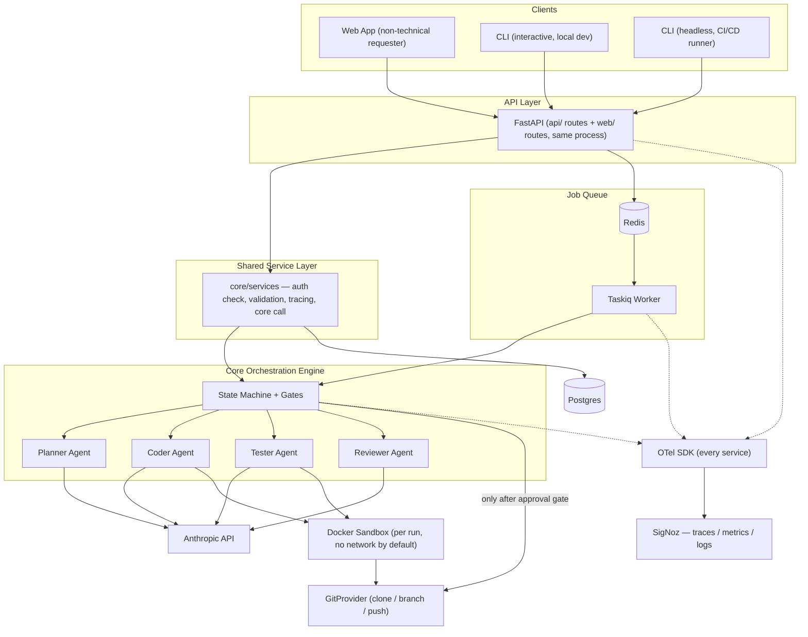
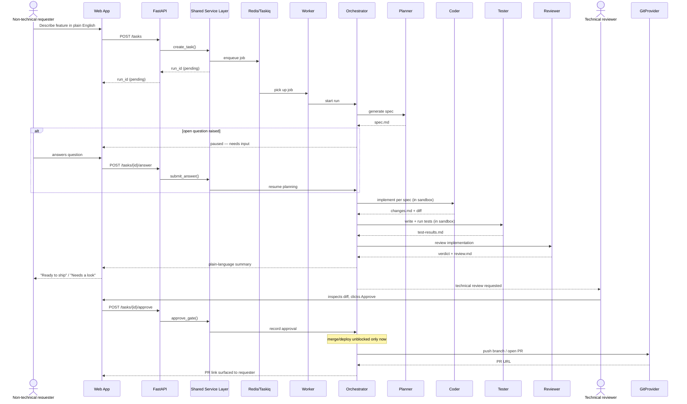

# OSWALD Architecture Specification

> [!NOTE]
> **TARGET END-STATE SPECIFICATION**: This document describes the intended end-state architecture, folder tree, and pipeline for OSWALD. The current repository contains the initial v1 backend scaffolding; full agent implementations, API routes, workers, and UI layers will be added iteratively as described here.

---

## 1. System Overview

OSWALD is an autonomous agent pipeline for software development running over an HTTP API. The pipeline transitions deterministically across four primary agent roles:
1. **Planner Agent**: Analyzes the problem statement and produces a structured specification (`spec.md`).
2. **Coder Agent**: Implements the specification in an isolated sandbox and generates diffs and changes (`changes.md`).
3. **Tester Agent**: Authors and runs test suites in the sandbox, verifying behavior (`test-results.md`).
4. **Reviewer Agent**: Evaluates the code against specifications, emitting a verdict (`review.md`).

A separate human approval gate is required before branch pushes or PR creation to VCS.

---

## 2. Target End-State Directory Structure

Below is the planned repository layout as components are implemented:

```
oswald/
├── docs/
│   ├── adr/
│   └── architecture.md
├── src/
│   └── oswald/
│       ├── core/
│       │   ├── orchestrator/      # State machine and composition root
│       │   ├── services/          # Shared service entry point into orchestrator
│       │   ├── agents/            # Agent role modules
│       │   │   └── prompts/       # Raw Markdown prompt files
│       │   ├── tools/             # Granular tools (one per role)
│       │   ├── artifacts/         # Pydantic artifact schemas & storage Protocol
│       │   ├── llm/               # LLMClient Protocol, provider adapters, budget
│       │   ├── sandbox/           # SandboxRuntime Protocol & Docker runtime
│       │   └── vcs/               # GitProvider Protocol & GitHub implementation
│       ├── api/
│       │   └── routes/            # FastAPI endpoints and route handlers
│       ├── web/                   # Jinja2 templates & static assets (future)
│       │   ├── templates/
│       │   └── static/
│       ├── cli/                   # Typer CLI commands (future)
│       │   └── commands/
│       ├── workers/               # Taskiq background worker & job definitions
│       ├── db/                    # SQLAlchemy models, repositories, run_events
│       └── observability/         # Structured logging and OTel setup
├── migrations/                    # Alembic schema migrations (future)
├── tests/
│   ├── unit/                      # Unit tests (fakes, no external services)
│   └── integration/               # Integration tests (Postgres, Redis, Docker)
├── docker/                        # App and sandbox base Dockerfiles (future)
└── .github/
    └── workflows/                 # CI pipelines
```

---

## 3. Architecture Diagrams

### System Architecture



---

### Request Lifecycle & Human Approval Gate



---

## 4. Architectural Boundaries and Rules

1. **`core/` Framework Isolation**:
   - Must contain pure business logic and protocols.
   - Strictly forbidden from importing `oswald.api`, `oswald.workers`, or `oswald.db`.
2. **`core/artifacts/` Pydantic Purity**:
   - Contains immutable schemas representing pipeline handoffs.
   - Strictly forbidden from importing `sqlalchemy` or ORM models.
3. **Single Entry Point**:
   - `core/services` is the exclusive public interface into `core/orchestrator`.
4. **VCS Segregation**:
   - `core/vcs` is the only component authorized to interact with git.
5. **Observability**:
   - Structured logs with `run_id` across all operations.
   - OTel SDK instrumented throughout with stdout export initially, enabling seamless transition to SigNoz or external telemetry collectors when needed.
